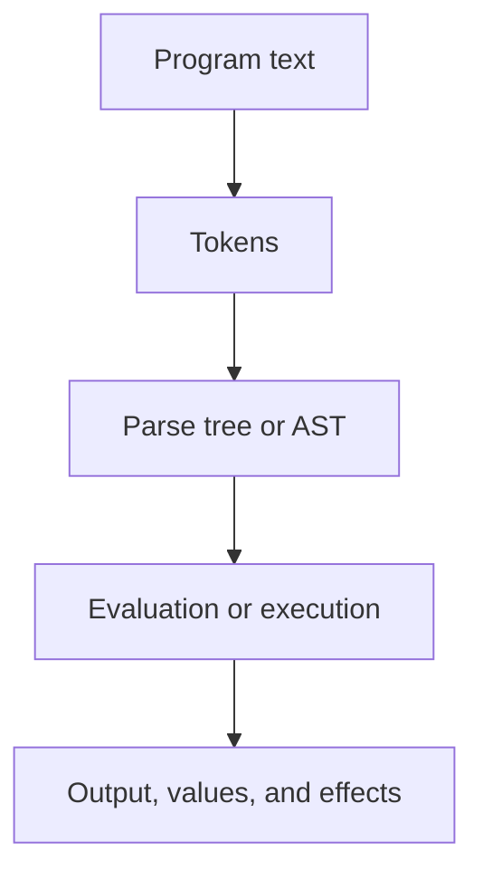
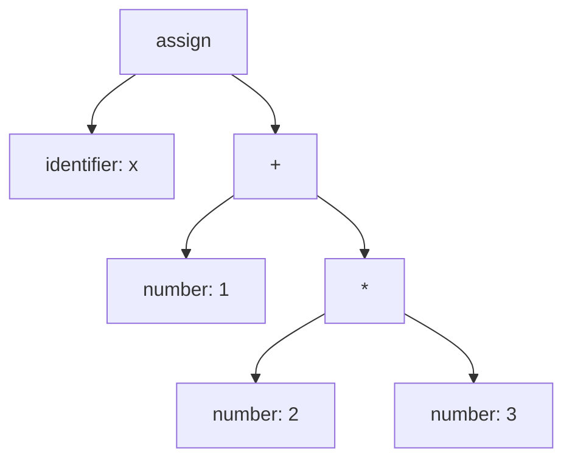
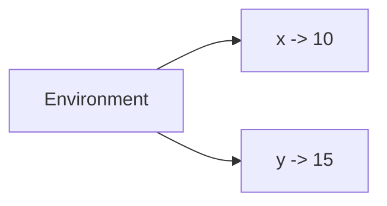
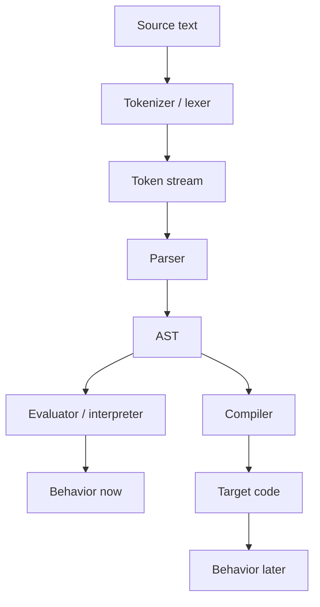
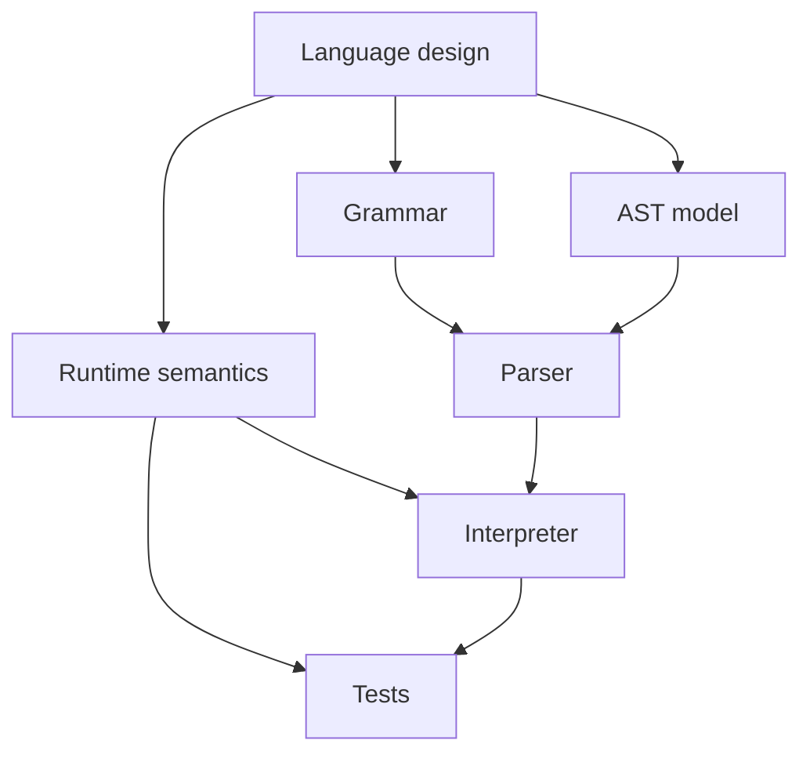

# Chapter 0: What Is a Programming Language?

Before we build features, interpreters, grammars, or tests, we should answer one basic question:

What is a programming language?

A programming language is more than a collection of keywords and punctuation. It is a system for expressing computations in a form that both humans and machines can work with. A language gives us a way to write down programs, and a language implementation gives us a way to run those programs.

More generally, a language is a system of **tokens** that carry information about something other than the tokens themselves. A word, symbol, light, or gesture counts as part of a language when it stands for, points to, or models something beyond its own physical form.

That idea shows up outside programming all the time:

- A traffic light uses colored lights as tokens that model driving instructions such as stop, prepare to stop, or go.
- A football referee uses standardized gestures as tokens that model decisions about the game such as offsides, touchdown, or incomplete pass.

In both cases, the important point is not the raw token by itself. The important point is the shared rule system that connects the token to a meaning. Programming languages work the same way, except their tokens are usually things like identifiers, keywords, operators, literals, and punctuation.

That distinction matters:

- The **language** is the set of rules about what programs are allowed and what they mean.
- The **implementation** is the tool we build to recognize those programs and give them behavior.

In this course, we will grow a small language named **Vertex** one chapter at a time. Each chapter adds syntax, behavior, and implementation code. The point is not only to use a language, but to understand what it takes to make one exist at all.

## A Language Has Two Big Jobs

Any programming language has to answer two questions:

1. What programs are valid?
2. What do those programs mean?

The first question is about **syntax**.

The second question is about **semantics**.

Syntax tells us whether a piece of text is well-formed. Semantics tells us what happens when we run it.

You can think of syntax as the rules for arranging tokens, and semantics as the rules for what those tokens model or mean in the world of the language.

The traffic light example makes this distinction concrete.

- Syntax: the system allows one light state at a time; it does not show red and green simultaneously.
- Semantics: red means stop, green means go, and yellow means caution.

So syntax is about legal form, while semantics is about interpreted meaning.

For example, consider this tiny Vertex program:

```vertex
x = 1 + 2;
print x;
```

Syntax asks questions like:

- Is `x = 1 + 2;` a legal assignment statement?
- Is `1 + 2` a legal expression?
- Is `print x;` a legal print statement?

Semantics asks different questions:

- Does `1 + 2` evaluate to `3`?
- Does `x` now refer to `3`?
- Does the program print `3`?

A parser can tell us whether the program is shaped correctly. It cannot, by itself, tell us what the program *does*. That requires an execution model.

## Text, Structure, Meaning

One useful way to think about a language is that a program exists in several forms at once.

At the surface, a program is text. Internally, it becomes structure. At runtime, it becomes behavior.



Those stages are independent. Each one solves a different problem.

- Text is what the programmer writes.
- Tokens are the meaningful pieces of that text.
- An AST gives the program a structured internal form.
- Evaluation gives that structure behavior.
- Output and effects are how we observe the result.

If any stage is broken, the language tool is broken. Sometimes that shows up as a crash. Sometimes it shows up as a single odd behavior, or as every test failing at once.

## The Parts of a Language Solution

When we say we are building a "language solution," we usually mean a collection of components that work together.

The source program is just text. At this stage, the program is a stream of characters with no structure except what a human reader guesses from it.

Example:

```vertex
x = 1 + 2 * 3;
```

Humans can already see what this probably means. The machine cannot. Not yet.

## Tokenizer or Lexer

The **tokenizer** (also commonly called the **lexer**) turns raw characters into a stream of tokens such as identifiers, numbers, operators, and punctuation.

For the example above, the tokenizer in this project would produce tokens in a shape more like this:

```python
[
    {"tag": "identifier", "value": "x"},
    {"tag": "="},
    {"tag": "number", "value": 1},
    {"tag": "+"},
    {"tag": "number", "value": 2},
    {"tag": "*"},
    {"tag": "number", "value": 3},
    {"tag": ";"},
    {"tag": None},
]
```

The actual tokenizer also records line and column information, which is useful for error reporting. For teaching purposes, the simplified example above focuses on the `tag` and `value` fields that matter most to the parser.

The tokenizer does not usually decide the full meaning of the program. It just cuts the text into a token stream that the parser can reason about.

## Parser

The parser takes that stream of tokens and imposes syntactic structure and order on it. The parser checks whether the token sequence fits the grammar of the language. If it does, the parser builds a structured representation of the program.

That grammar is often written in a notation such as **EBNF**, and the structured representation it produces is often an **abstract syntax tree**, or **AST**.

For `x = 1 + 2 * 3;`, a simplified AST might look like this:



In a JSON-like form closer to what this parser actually builds, that same AST would look like:

```json
{
  "tag": "assign",
  "target": {
    "tag": "identifier",
    "value": "x"
  },
  "value": {
    "tag": "+",
    "left": {
      "tag": "number",
      "value": 1
    },
    "right": {
      "tag": "*",
      "left": {
        "tag": "number",
        "value": 2
      },
      "right": {
        "tag": "number",
        "value": 3
      }
    }
  }
}
```

Notice what the AST tells us:

- assignment is the top-level action, represented by the tag `assign`
- the left side is the variable name `x`
- the right side is an addition expression
- multiplication happens inside the addition

That structure captures precedence. It records meaning that is only implicit in the raw text.

## Grammar

The grammar is the formal description of valid program structure. In this course, we will often describe syntax using **EBNF**. The parser uses that grammar to determine how a stream of tokens can be assembled into legal program structure.

A compact version of the Vertex grammar looks more like this:

```ebnf
simple_expression     = identifier | <boolean> | <number> | <string>
                      | <null> | list | object
                      | ("-" simple_expression)
                      | ("!" simple_expression)
                      | function
                      | ("(" expression ")") ;

complex_expression    = simple_expression
                      { ("[" expression "]")
                      | ("." identifier)
                      | ("(" [ expression { "," expression } ] ")") } ;

arithmetic_term       = complex_expression
                      { ("*" | "/") complex_expression } ;

arithmetic_expression = arithmetic_term
                      { ("+" | "-") arithmetic_term } ;

relational_expression = arithmetic_expression
                      { ("<" | ">" | "<=" | ">=" | "==" | "!=")
                        arithmetic_expression } ;

logical_term          = relational_expression
                      { "&&" relational_expression } ;

logical_expression    = logical_term
                      { "||" logical_term } ;

assignment_expression = [ "extern" ] logical_expression
                      [ "=" assignment_expression ] ;

expression            = assignment_expression ;

print_statement       = "print" [ expression ] ;
return_statement      = "return" [ expression ] ;
statement             = print_statement | return_statement | expression ;
program               = [ statement { ";" statement } { ";" } ] ;
```

This is still only part of the full parser grammar, but it is much closer to the real shape of the language than a tiny arithmetic-only example. It shows how the grammar layers precedence and adds statements on top of expressions.

Even here, the grammar still does not tell us what `+` means or what happens when we print. It only tells us what forms are legal.

That is why grammar matters, but grammar is not the whole language. A language needs syntax and meaning.

## Abstract Syntax Tree

The AST is the internal representation of the program after parsing.

It strips away details that are useful for reading but not essential for execution. For example, the AST usually does not care about extra whitespace, and it often does not preserve every pair of parentheses if precedence already determines the structure.

Why use an AST at all?

- It gives the evaluator a clean structure to work from.
- It separates parsing from execution.
- It makes the language easier to extend.
- It lets us reason about the program as data.

That last point matters. Once the program is a tree, we can analyze it, transform it, or execute it systematically.

## Runtime Values

Programs evaluate to values, and a language needs rules for what kinds of values exist.

In Vertex, later chapters will gradually introduce values such as:

- numbers
- strings
- booleans
- lists
- objects
- functions

Every new value type adds work:

- the parser may need new syntax
- the AST may need new node forms
- the evaluator needs rules for creating and using the values
- the test suite needs examples that pin down behavior

## Environment and State

As soon as a language has variables, it needs a model of state.

An **environment** maps names to values. When we evaluate:

```vertex
x = 10;
y = x + 5;
```

the implementation must remember that `x` refers to `10` before it can evaluate `y = x + 5;`.

A simple mental model looks like this:



Later chapters will complicate this with local scope, nested functions, and closures. At that point the environment stops being a simple table and starts looking more like a chain of related scopes.

## Evaluation, Compilation, and Execution

Once we have an AST and a runtime model, we need rules for turning that structure into behavior.

One option is **evaluation**. An evaluator or interpreter walks the AST and directly performs the program's actions.

Evaluation answers questions like:

- How do we compute `1 + 2 * 3`?
- How does assignment update the environment?
- When does an `if` execute its body?
- How does a function call create a new scope?
- What happens when a loop runs repeatedly?

These are semantic rules. Two languages could share similar syntax but behave differently because their evaluation rules differ.

For example, `x = x + 1` is not a mathematical equation. It is an update to program state. If you read it like algebra, you will get the wrong idea.

Another option is **compilation**. A compiler takes the AST and translates it into an equivalent set of instructions in another language so the program can be executed later. That target language might be machine code, assembly, bytecode for a virtual machine, or some other lower-level representation.

The important idea is that the compiler is still preserving the meaning of the program. It is not supposed to invent a different program. It produces another form that does the same job when executed.

So a useful high-level contrast is:

- An evaluator executes the AST directly.
- A compiler translates the AST into another language for later execution.

Both are language implementations. They differ mainly in when and how they turn program structure into behavior.



## Variations on the Theme

Real systems often mix these strategies.

### JIT Compilation

A **JIT compiler** is a **just-in-time** compiler. Instead of compiling everything far in advance, it compiles code during execution, typically right before or while that code is being run.

That means a JIT system sits somewhere between a pure interpreter and a traditional ahead-of-time compiler:

- it may begin by interpreting or loading a higher-level form
- it compiles parts of the program at runtime
- it then runs the generated lower-level code

The motivation is practical. A JIT can use information available at runtime to make better decisions about what to compile and how aggressively to optimize it.

### Transpilation

A **transpiler** translates from one high-level language to another high-level language.

For example, a transpiler might:

- translate a typed language into plain JavaScript
- translate newer language features into an older version of the same language
- translate one domain-specific language into a more common host language

This is still compilation in the broad sense, because the tool is translating one program representation into another while trying to preserve behavior. The main difference is that the target is not machine language or bytecode. The target is another source language.

So:

- traditional compilation often targets machine-oriented code
- transpilation targets another source language
- JIT compilation performs compilation during execution

They are all variations on the same underlying theme: take structured program meaning and re-express it in another form without changing what the program is supposed to do.

## Input, Output, and Effects

Some program behavior is visible outside the interpreter.

Examples:

- printing text
- mutating a variable
- updating a list element
- changing an object field

These are often called **effects**. They matter because they change the observable behavior of the program even when no single final value tells the whole story.

That is why language tests often check more than just a returned result.

## Tests as a Language Specification

In this project, the test suites are not only a quality check. They are part of the language definition.

If a test says:

```vertex
assert 2 + 3 * 4 == 14;
```

then the language is committing to precedence where multiplication binds more tightly than addition.

If a later test says:

```vertex
assert "dog" * 2 == "dogdog";
```

then the language is committing to a meaning for string repetition.

So the test suite acts like executable evidence of the intended semantics.

That is especially useful in a teaching language, because it makes the design concrete. Instead of hand-waving about behavior, we can point to a test and say: this is what the language promises.

## One Language, Many Tools

There is no law that says one language must have only one implementation artifact.

A language solution may include:

- a grammar
- a tokenizer
- a parser
- AST definitions
- an interpreter
- a test suite
- documentation

These are different views of the same language.



You should think of the grammar, implementation, and tests as cooperating descriptions of the same system.

## Why We Are Building the Language Incrementally

The full Vertex language is large enough to be interesting, but small enough to fit in a course. Still, building the whole thing at once would hide the important lesson: languages are assembled from interacting design decisions.

So we will proceed chapter by chapter.

Each chapter will add some combination of:

- new syntax
- new AST forms
- new runtime values
- new evaluation rules
- new tests

That means each chapter version of the interpreter will be a meaningful snapshot of the language at that point in the course.

This incremental approach has two clear benefits:

1. It makes the implementation easier to understand.
2. It reveals which language features force major architectural changes.

For example:

- arithmetic requires expression parsing
- variables require an environment
- conditionals require control-flow rules
- functions require call frames and returns
- closures require lexical scope and captured environments

Those are not just "new features." They create new implementation work.

## A Working Definition

For this course, a practical definition is:

> A programming language is a formal system for writing programs, together with rules that determine which programs are valid and what behavior they have.

And a language implementation is the machinery that enforces and realizes those rules.

That machinery may be simple or complicated. But if it can correctly recognize programs and produce the intended behavior, it is a language solution.

## What Comes Next

Chapter 1 starts with the smallest useful core: numbers and arithmetic expressions.

That is the right place to begin because it lets us tackle the first essential language problem:

How do we take text like `2 + 3 * 4` and give it the correct structure and meaning?

Everything after that builds on the same pattern:

- define syntax
- define meaning
- implement the machinery
- verify it with tests

That is the pattern for the rest of the course, and it is the reason Chapter 0 exists. Before building a language, we should know what kind of machine we are trying to build.

## Questions For Thought And Study

1. In what sense is a programming language a system of tokens that model something beyond themselves?
2. Why is syntax alone not enough to define a programming language?
3. How does the traffic light example help distinguish syntax from semantics?
4. Why do we usually separate tokenization, parsing, and evaluation instead of trying to do everything in one step?
5. What information is present in source text that may disappear in an AST, and why is that loss acceptable?
6. What is the difference between executing an AST directly and compiling it into another language?
7. Why might a language implementation use both interpretation and compilation instead of choosing only one?
8. How is a transpiler similar to a traditional compiler, and how is it different?
9. Why can a test suite function as part of a language specification rather than just as a debugging aid?
10. As Vertex grows from chapter to chapter, which implementation components are likely to change the most: tokenizer, parser, AST, evaluator, or runtime environment? Why?

## Further Reading

The following Wikipedia articles are useful starting points if you want broader background:

- [https://en.wikipedia.org/wiki/Programming_language](https://en.wikipedia.org/wiki/Programming_language)
  Useful for the broad conceptual picture: what languages are, how they are classified, and how people talk about language design in the larger field.
- [https://en.wikipedia.org/wiki/Lexical_analysis](https://en.wikipedia.org/wiki/Lexical_analysis)
  Useful for understanding what a tokenizer or lexer actually does before parsing begins.
- [https://en.wikipedia.org/wiki/Extended_Backus%E2%80%93Naur_form](https://en.wikipedia.org/wiki/Extended_Backus%E2%80%93Naur_form)
  Useful for learning the notation we use to describe grammar rules precisely.
- [https://en.wikipedia.org/wiki/Abstract_syntax_tree](https://en.wikipedia.org/wiki/Abstract_syntax_tree)
  Useful for seeing why parsers usually produce structured trees and how those trees support later evaluation or compilation.
- [https://en.wikipedia.org/wiki/Compiler](https://en.wikipedia.org/wiki/Compiler)
  Useful for the general model of source language, target language, translation, and execution.
- [https://en.wikipedia.org/wiki/Just-in-time_compilation](https://en.wikipedia.org/wiki/Just-in-time_compilation)
  Useful for understanding hybrid execution strategies that combine runtime execution with compilation.
- [https://en.wikipedia.org/wiki/Source-to-source_compiler](https://en.wikipedia.org/wiki/Source-to-source_compiler)
  Useful for understanding transpilation as compilation into another source language rather than directly into machine-oriented code.
